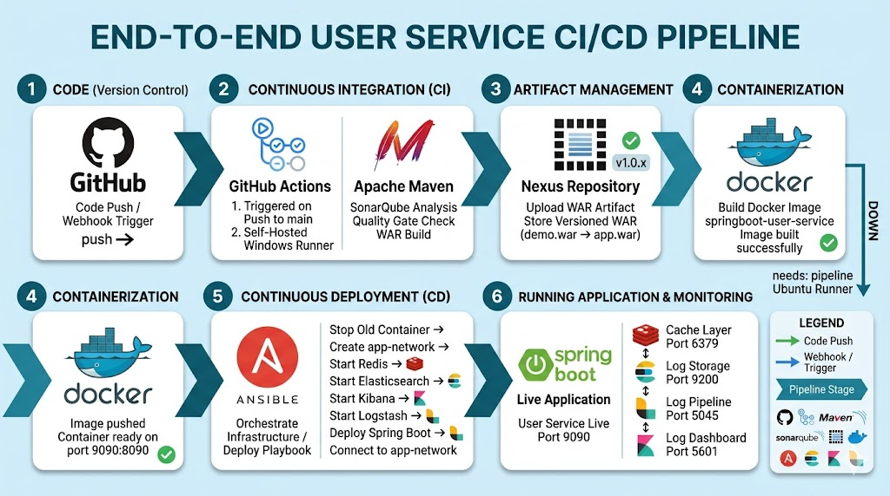
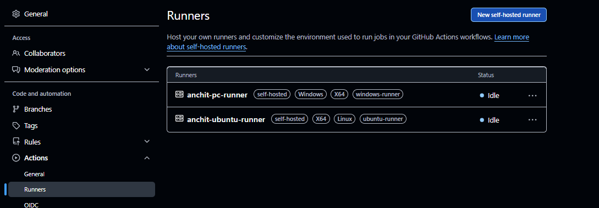
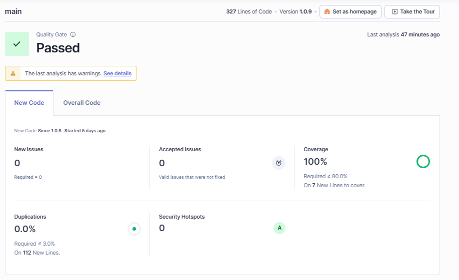
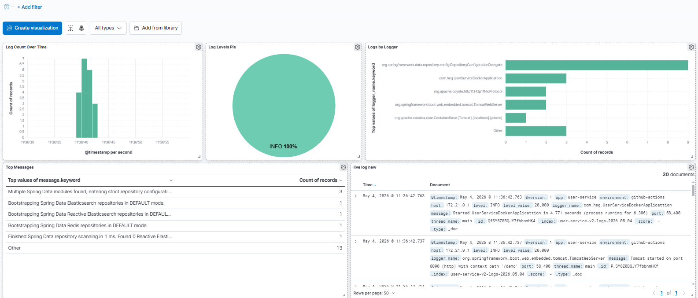
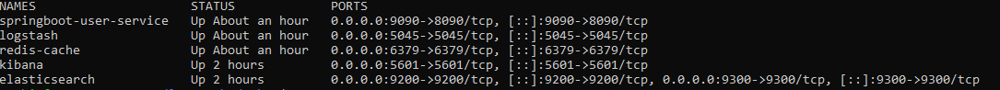

# 🚀 End-to-End User Service CI/CD Pipeline

> A fully automated DevOps pipeline for a Spring Boot User Service — from code push to live deployment with real-time log monitoring via the ELK Stack.

<!-- 📸 IMAGE PLACEHOLDER 1 -->
<!-- Add your CI/CD pipeline architecture diagram image here -->
<!-- Suggested: The pipeline workflow diagram you generated showing all 6 stages -->


---

## 📋 Table of Contents

- [Project Overview](#-project-overview)
- [Tech Stack](#-tech-stack)
- [Pipeline Stages](#-pipeline-stages)
- [Prerequisites](#-prerequisites)
- [Setup Guide](#-setup-guide)
  - [1. Windows Machine Setup](#1-windows-machine-setup)
  - [2. Ubuntu Machine Setup](#2-ubuntu-machine-setup)
  - [3. GitHub Actions Runner Setup](#3-github-actions-runner-setup)
  - [4. SonarQube Setup](#4-sonarqube-setup)
  - [5. Nexus Repository Setup](#5-nexus-repository-setup)
  - [6. Ansible Setup](#6-ansible-setup)
  - [7. ELK Stack Setup](#7-elk-stack-setup)
  - [8. Kibana Dashboard Setup](#8-kibana-dashboard-setup)
- [How to Run](#-how-to-run)
- [Verify Everything is Working](#-verify-everything-is-working)
- [Project Structure](#-project-structure)
- [Common Issues & Fixes](#-common-issues--fixes)
- [API Endpoints](#-api-endpoints)

---

## 📌 Project Overview

This project demonstrates a complete **End-to-End CI/CD pipeline** for a Spring Boot REST API (User Service). Every time code is pushed to the `main` branch on GitHub, the pipeline automatically:

1. Runs **code quality analysis** via SonarQube
2. Uploads the built artifact to **Nexus Repository**
3. Builds a **Docker image** of the Spring Boot app
4. Deploys the container on a **Windows self-hosted runner**
5. Sets up full infrastructure (**Redis, Elasticsearch, Kibana, Logstash**) on Ubuntu
6. Deploys the app via **Ansible** playbook
7. Verifies all services are healthy

<!-- 📸 IMAGE PLACEHOLDER 2 -->
<!-- Add a screenshot of a successful GitHub Actions pipeline run here -->
<!-- Suggested: GitHub Actions run page showing all green checkmarks -->


---

## 🛠 Tech Stack

| Category | Tool | Version |
|---|---|---|
| Source Control | GitHub | — |
| CI/CD | GitHub Actions (Self-Hosted) | — |
| Code Quality | SonarQube | Latest |
| Artifact Storage | Nexus Repository | Latest |
| Build Tool | Apache Maven | 3.9.12 |
| App Framework | Spring Boot | 3.x |
| Containerization | Docker | Latest |
| Config Management | Ansible | Latest |
| Caching | Redis | alpine |
| Log Shipper | Logstash | 7.17.10 |
| Log Storage | Elasticsearch | 7.17.10 |
| Log Visualization | Kibana | 7.17.10 |

---

## 🔄 Pipeline Stages

```
GitHub Push (main branch)
         │
         ▼
┌─────────────────────────────────────────┐
│        JOB 1 — Windows Runner           │
│                                         │
│  Phase 1 ── SonarQube Quality Gate      │
│  Phase 2 ── Upload WAR to Nexus         │
│  Phase 3 ── Maven Build + Docker Image  │
│  Phase 4 ── Deploy Spring Boot (9090)   │
└─────────────────────────────────────────┘
         │
         │  needs: pipeline
         ▼
┌─────────────────────────────────────────┐
│        JOB 2 — Ubuntu Runner            │
│                                         │
│  Phase 5 ── Setup Infrastructure        │
│             Redis + ES + Kibana +       │
│             Logstash                    │
│  Phase 6 ── Ansible Deploy              │
│  Phase 7 ── Verify All Services         │
└─────────────────────────────────────────┘
```

---

## ✅ Prerequisites

### Windows Machine
- Java JDK 17 installed at `C:\Program Files\Java\jdk-17`
- Apache Maven 3.9.12 installed at `C:\maven\`
- Docker Desktop installed and running
- GitHub Actions self-hosted runner registered (windows-runner)
- SonarQube running at `http://localhost:9000`
- Nexus Repository running at `http://localhost:8081`

### Ubuntu Machine
- Docker installed and running
- Ansible installed (`pip install ansible`)
- GitHub Actions self-hosted runner registered (ubuntu-runner)
- Python 3 installed

---

## 🔧 Setup Guide

### 1. Windows Machine Setup

#### Install Java JDK 17
Download from [https://www.oracle.com/java/technologies/downloads/](https://www.oracle.com/java/technologies/downloads/) and install to default path.

Verify:
```cmd
java -version
```

#### Install Maven
Download Maven 3.9.12, extract to `C:\maven\` and add to PATH.

Verify:
```cmd
mvn -version
```

#### Install Docker Desktop
Download from [https://www.docker.com/products/docker-desktop/](https://www.docker.com/products/docker-desktop/) and enable WSL2 backend.

Verify:
```cmd
docker --version
docker ps
```

---

### 2. Ubuntu Machine Setup

#### Install Docker
```bash
sudo apt update
sudo apt install -y docker.io
sudo systemctl start docker
sudo systemctl enable docker
sudo usermod -aG docker $USER
```

Verify:
```bash
docker --version
docker ps
```

#### Install Ansible
```bash
sudo apt install -y python3-pip
pip install ansible
echo 'export PATH=$PATH:/home/anchit/.local/bin' >> ~/.bashrc
source ~/.bashrc
```

Verify:
```bash
ansible --version
```

---

### 3. GitHub Actions Runner Setup

#### Windows Runner
1. Go to your GitHub repo → **Settings** → **Actions** → **Runners** → **New self-hosted runner**
2. Select **Windows**
3. Follow the commands shown — download, configure with label `windows-runner`
4. Start the runner:
```cmd
.\run.cmd
```

#### Ubuntu Runner
1. Go to your GitHub repo → **Settings** → **Actions** → **Runners** → **New self-hosted runner**
2. Select **Linux**
3. Follow the commands — download, configure with label `ubuntu-runner`
4. Start as service:
```bash
sudo ./svc.sh install
sudo ./svc.sh start
```

Verify both runners show **Idle** status in GitHub Settings → Actions → Runners.

<!-- 📸 IMAGE PLACEHOLDER 3 -->
<!-- Add a screenshot of GitHub Settings showing both runners as "Idle" (green dot) -->


---

### 4. SonarQube Setup

SonarQube runs on the **Windows machine** at `http://localhost:9000`.

#### Start SonarQube (if not running)
```cmd
# Navigate to SonarQube bin folder and run:
StartSonar.bat
```

#### Generate Token
1. Login at `http://localhost:9000` (admin/admin)
2. Go to **My Account** → **Security** → **Generate Token**
3. Copy the token and update `SONAR_TOKEN` in `ci.yml`

#### Create Project
1. **Projects** → **Create Project** → **Manually**
2. Project Key: `user-service`
3. Display Name: `User Service`

<!-- 📸 IMAGE PLACEHOLDER 4 -->
<!-- Add a screenshot of SonarQube showing Quality Gate PASSED -->


---

### 5. Nexus Repository Setup

Nexus runs on the **Windows machine** at `http://localhost:8081`.

#### First Time Login
- Default credentials: `admin` / (check `admin.password` file in nexus data dir)

#### Create Maven Repository
1. **Settings** → **Repositories** → **Create repository**
2. Type: `maven2 (hosted)`
3. Name: `maven-releases`
4. Click **Create**

#### Configure `settings.xml`
Create/update `C:\maven\settings.xml`:
```xml
<settings>
  <servers>
    <server>
      <id>nexus</id>
      <username>admin</username>
      <password>YOUR_NEXUS_PASSWORD</password>
    </server>
  </servers>
  <mirrors>
    <mirror>
      <id>nexus</id>
      <mirrorOf>*</mirrorOf>
      <url>http://localhost:8081/repository/maven-public/</url>
    </mirror>
  </mirrors>
</settings>
```

---

### 6. Ansible Setup

On your **Ubuntu machine**, set up the Ansible inventory and playbook:

#### Directory Structure
```
/home/anchit/github-actions-ansible/
├── inventory.yml
└── deploy-playbook.yml
```

#### inventory.yml
```yaml
all:
  hosts:
    localhost:
      ansible_connection: local
```

#### deploy-playbook.yml
```yaml
---
- name: Deploy Spring Boot User Service
  hosts: localhost
  tasks:
    - name: Stop old container
      shell: docker stop springboot-user-service || true

    - name: Remove old container
      shell: docker rm springboot-user-service || true

    - name: Run new container
      shell: |
        docker run -d \
          --name springboot-user-service \
          -p 9090:8090 \
          --restart unless-stopped \
          springboot-user-service
```

Verify Ansible works:
```bash
export PATH=$PATH:/home/anchit/.local/bin
ansible-playbook -i /home/anchit/github-actions-ansible/inventory.yml \
  /home/anchit/github-actions-ansible/deploy-playbook.yml
```

---

### 7. ELK Stack Setup

All ELK components run on the **Ubuntu machine** via Docker. The CI pipeline starts them automatically, but here are the manual commands if needed.

#### Create Docker Network
```bash
docker network create app-network
```

#### Start Elasticsearch
```bash
docker run -d \
  --name elasticsearch \
  --network app-network \
  -p 9200:9200 \
  -p 9300:9300 \
  -e "discovery.type=single-node" \
  -e "ES_JAVA_OPTS=-Xms512m -Xmx512m" \
  --restart unless-stopped \
  elasticsearch:7.17.10
```

Verify:
```bash
curl http://localhost:9200/_cluster/health
```

#### Start Kibana
```bash
docker run -d \
  --name kibana \
  --network app-network \
  -p 5601:5601 \
  -e "ELASTICSEARCH_HOSTS=http://elasticsearch:9200" \
  --restart unless-stopped \
  kibana:7.17.10
```

Verify:
```bash
curl -s http://localhost:5601/api/status | grep -o '"level":"[^"]*"'
```

Access Kibana at: `http://<UBUNTU-IP>:5601`

#### Start Logstash
```bash
mkdir -p /tmp/logstash-pipeline
cp /path/to/logstash.conf /tmp/logstash-pipeline/logstash.conf

docker run -d \
  --name logstash \
  --network app-network \
  -p 5045:5045 \
  -v /tmp/logstash-pipeline/logstash.conf:/usr/share/logstash/pipeline/logstash.conf \
  --restart unless-stopped \
  logstash:7.17.10
```

#### Start Redis
```bash
docker run -d \
  --name redis-cache \
  --network app-network \
  -p 6379:6379 \
  --restart unless-stopped \
  redis:alpine
```

Verify Redis:
```bash
docker exec redis-cache redis-cli ping
# Expected output: PONG
```

#### logstash.conf (already in repo root)
```
input {
  tcp {
    port => 5045
    codec => json_lines
  }
}

output {
  elasticsearch {
    hosts => ["http://host.docker.internal:9200"]
    index => "user-service-v2-logs-%{+yyyy.MM.dd}"
  }
  stdout { codec => rubydebug }
}
```

---

### 8. Kibana Dashboard Setup

> ⚠️ Do this **once** after first pipeline run. The CI preserves your dashboards on every subsequent run.

#### Step 1 — Create Index Pattern
1. Open Kibana at `http://<UBUNTU-IP>:5601`
2. Go to **Stack Management** → **Index Patterns** → **Create index pattern**
3. Name: `user-service-v2-logs-*`
4. Timestamp field: `@timestamp`
5. Click **Create index pattern** ✅

#### Step 2 — Generate Some Logs
```bash
curl http://localhost:9090/demo/users
curl http://localhost:9090/demo/users/1
```

#### Step 3 — Check Log Count in ES
```bash
curl http://localhost:9200/user-service-v2-logs-*/_count
```

#### Step 4 — Create Dashboard
1. Go to **Visualize Library** → **Create visualization** → **Lens**
2. Create these 4 panels:

| Panel Name | Chart Type | Config |
|---|---|---|
| Log Count Over Time | Bar/Line | X: `@timestamp`, Y: Count |
| Log Levels Distribution | Pie | Slice by: `level.keyword` |
| Top Log Messages | Table | Row: `message.keyword` Top 10 |
| Logs by Logger | Horizontal Bar | X: `logger_name.keyword` Top 10 |

3. Go to **Dashboard** → **Create dashboard** → **Add from library**
4. Add all 4 panels
5. Name: `User Service Monitor`
6. Save ✅

#### Step 5 — Add Live Log Stream
1. Go to **Discover** → select `user-service-v2-logs-*`
2. Set time: **Last 24 hours**
3. **Save** as `Live Log Stream`
4. Add to your dashboard from library ✅

<!-- 📸 IMAGE PLACEHOLDER 5 -->
<!-- Add a screenshot of your Kibana dashboard showing all panels with data -->


---

## ▶️ How to Run

### Automatic (Recommended)
Simply push code to the `main` branch:
```bash
git add .
git commit -m "your commit message"
git push origin main
```

The GitHub Actions pipeline will run automatically and handle everything! ✅

### Manual (if needed)
If you need to start services manually on Ubuntu:
```bash
# Start all infrastructure
docker network create app-network || true
docker start elasticsearch || docker run -d --name elasticsearch --network app-network -p 9200:9200 -p 9300:9300 -e "discovery.type=single-node" -e "ES_JAVA_OPTS=-Xms512m -Xmx512m" --restart unless-stopped elasticsearch:7.17.10
docker start kibana || docker run -d --name kibana --network app-network -p 5601:5601 -e "ELASTICSEARCH_HOSTS=http://elasticsearch:9200" --restart unless-stopped kibana:7.17.10
docker start redis-cache || docker run -d --name redis-cache --network app-network -p 6379:6379 --restart unless-stopped redis:alpine
```

---

## ✔️ Verify Everything is Working

Run these commands on your **Ubuntu machine** to confirm all services are healthy:

```bash
# 1. Check all running containers
docker ps --format "table {{.Names}}\t{{.Status}}\t{{.Ports}}"

# 2. Spring Boot app
curl http://localhost:9090/demo/users

# 3. Redis
docker exec redis-cache redis-cli ping

# 4. Elasticsearch cluster health
curl -s http://localhost:9200/_cluster/health | grep -o '"status":"[^"]*"'

# 5. Check logs indexed in ES
curl http://localhost:9200/user-service-v2-logs-*/_count

# 6. Kibana status
curl -s http://localhost:5601/api/status | grep -o '"level":"[^"]*"'

# 7. Logstash logs
docker logs logstash --tail 10
```

Expected healthy output:
```
redis-cache    → PONG
elasticsearch  → "status":"green"
kibana         → "level":"available"
spring boot    → JSON user list response
```

<!-- 📸 IMAGE PLACEHOLDER 6 -->
<!-- Add a screenshot of terminal showing all services healthy (green status) -->


---

## 📁 Project Structure

```
Docker-User-Service-Docker/
│
├── .github/
│   └── workflows/
│       └── ci.yml              ← Full CI/CD pipeline definition
│
├── src/
│   └── main/
│       ├── java/
│       │   └── c/heg/          ← Spring Boot source code
│       └── resources/
│           └── logback-spring.xml  ← Logstash TCP appender config
│
├── Dockerfile                  ← Docker image definition
├── logstash.conf               ← Logstash pipeline config
├── docker-compose.yml          ← Local dev docker-compose
├── pom.xml                     ← Maven dependencies & build config
└── README.md                   ← This file
```

---

## 🔴 Common Issues & Fixes

| Issue | Cause | Fix |
|---|---|---|
| `Connection refused` on port 5045 | Spring Boot using `localhost` inside container | Use `host.docker.internal:5045` in `logback-spring.xml` |
| Kibana shows "No results" | Wrong time range selected | Change to "Last 24 hours" in Kibana top-right |
| Logstash mount error in CI | WSL2 bind mount issue | Copy conf to `/tmp/logstash-pipeline/` first |
| Kibana dashboards wiped on pipeline run | CI was recreating Kibana every run | CI now uses "start only if not running" logic |
| GitHub Actions YAML syntax error | Wrong indentation in ci.yml | Each step must be indented exactly 6 spaces |
| `demo.war not found` | Maven build failed | Check `pom.xml` has `<packaging>war</packaging>` |
| ES index count is 0 | Logstash not connected to ES | Ensure both on same Docker network (`app-network`) |
| Ansible playbook fails | PATH missing for ansible binary | Add `export PATH=$PATH:/home/anchit/.local/bin` |

---

## 🌐 API Endpoints

Base URL: `http://localhost:9090/demo`

| Method | Endpoint | Description |
|---|---|---|
| GET | `/users` | Get all users |
| GET | `/users/{id}` | Get user by ID |
| POST | `/users` | Create new user |
| PUT | `/users/{id}` | Update user |
| DELETE | `/users/{id}` | Delete user |

---

## 🖥️ Service URLs

| Service | URL |
|---|---|
| Spring Boot App | `http://localhost:9090/demo/users` |
| SonarQube | `http://localhost:9000` |
| Nexus Repository | `http://localhost:8081` |
| Elasticsearch | `http://localhost:9200` |
| Kibana | `http://<UBUNTU-IP>:5601` |

---

## 📝 Notes

- All three ELK components **must be the same version** (7.17.10) — version mismatch causes connection failures
- The pipeline has **two jobs** — Job 1 runs on Windows, Job 2 runs on Ubuntu. Job 2 only starts after Job 1 succeeds (`needs: pipeline`)
- Kibana index patterns and dashboards **persist across pipeline runs** — you only need to set them up once
- The `logstash.conf` in the repo root is automatically picked up by the CI pipeline and mounted into the Logstash container

---

<p align="center">Made with ❤️ by <a href="https://github.com/anchitchourasia">Anchit Chourasia</a></p>
